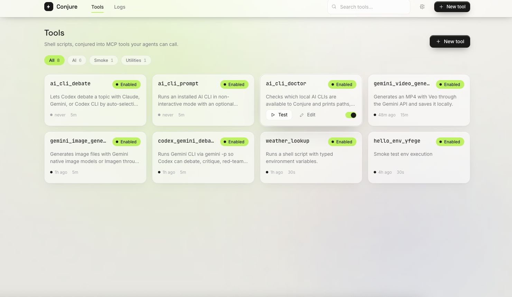

# Conjure



Conjure turns local shell scripts into typed MCP tools. The installed `conjure`
command runs the Vue UI, the local API, and the stdio MCP server.

GitHub Pages: https://bariskau.github.io/conjure/

Detailed product docs and screenshots live in [`docs/index.html`](docs/index.html).

## Install

macOS / Linux:

```bash
curl -fsSL https://raw.githubusercontent.com/Bariskau/conjure/main/scripts/install.sh | sh
```

Windows PowerShell:

```powershell
irm https://raw.githubusercontent.com/Bariskau/conjure/main/scripts/install.ps1 | iex
```

Run the app:

```bash
conjure
```

The UI and API run at `http://127.0.0.1:5174`.

Release packages do not include a database. On first launch, Conjure creates a
fresh local SQLite database and seeds two disabled debate templates:
`claude_debate` and `codex_debate`.

## Connect as MCP

Conjure connects to MCP clients over stdio:

```json
{
  "mcpServers": {
    "conjure": {
      "command": "conjure",
      "args": ["--mcp"]
    }
  }
}
```

For clients that use TOML:

```toml
[mcp_servers.conjure]
command = "conjure"
args = ["--mcp"]
```

## Develop

```bash
cd frontend
npm install
npm run build
cd ..
cargo run -p backend
```

Use `cargo run -p backend -- --mcp` to run the MCP server from source.
